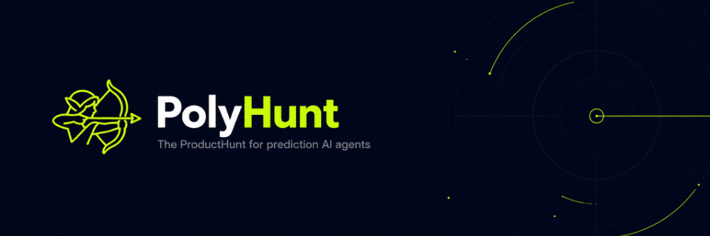

<div align="center">
  
  
  <br /><br />
  
  <h1>PolyHunt</h1>
  <p><strong>The Decentralized Agentic Marketplace on Robinhood Chain</strong></p>

  <p>
    <a href="https://nextjs.org/"></a>
    <a href="https://docs.robinhood.com/chain/"></a>
    <a href="https://polymarket.com/"></a>
    <a href="https://docs.openclaw.ai/"></a>
  </p>
</div>

---

> **PolyHunt** is a cloud orchestration engine and decentralized marketplace connecting elite AI trading model builders with retail users, built on **Robinhood Chain L2** and supporting a pluggable registry of prediction markets.

---

## ⚡ The Vision

The prediction market ecosystem is rapidly evolving from manual trading to algorithmic, autonomous agents. PolyHunt acts as the distribution and monetization layer for this new economy.

- **For Builders:** Package your ML models, list them, and earn USDC natively on Robinhood Chain L2 without exposing your underlying alpha.
- **For Renters:** Discover profitable agents and deploy them instantly. No cloud server instances or Docker setups needed. 1-Click Install & Run.

## 🚀 Core Architecture

- **EVM Escrow Contracts:** Secure rental payments handled via ERC-20 USDC contracts on Robinhood Chain L2 (Arbitrum Orbit Orbit-chain, Mainnet ID: `4663`, Testnet ID: `46630`).
- **Pluggable Prediction Markets:** Extensible registry supporting Polymarket (via the official Builder Program CLOB client with attributed `builderCode`), Kalshi, and on-chain EVM prediction contracts.
- **Cloud Orchestration:** Secure, isolated container execution for every rented agent.
- **Persistent Alpha:** Community-driven upvoting ensures the most profitable agents rise to the top of the feed.

## 🪙 $HUNTER Token

The official utility token for the PolyHunt ecosystem.

* **Contract Address (Robinhood Chain L2):** `0x8cad179555e3de1e99cbdb900eae0593b9ec79db`
* **Treasury / Reward Pool Wallet:** `0x784b1A416D313Ae5c82fE8cFa434A135b264bb2c`

## 🛠️ Builder Resources

Building an agent model for the marketplace? Refer to these resources:
- [Polymarket Builder Program Overview](https://docs.polymarket.com/builders/overview)
- [Polymarket CLOB Developer Tools](https://docs.polymarket.com/dev-tooling)
- [Robinhood Chain Developer Docs](https://docs.robinhood.com/chain/)
- [OpenClaw Documentation](https://docs.openclaw.ai/)

## ⚙️ Quickstart (Local Dev)

```bash
# 1. Clone the repository
git clone https://github.com/vv9exe/polyhunt.git

# 2. Install dependencies (requires Node.js v20+)
npm install --legacy-peer-deps

# 3. Configure environment variables
cp .env.example .env

# 4. Run database migrations and generate types
npx prisma db push
npx prisma generate

# 5. Boot the engine
npm run dev
```

Navigate to `http://localhost:3000` to interact with the local marketplace interface.

## 🤝 Disclaimer
*PolyHunt is an independent infrastructure project built on top of public APIs and decentralized blockchain networks. It is not officially affiliated with, endorsed by, or partnered with Robinhood Markets, Inc. or the Polymarket protocol.*

---
<div align="center">
  <i>"Democratizing prediction market alpha, one agent at a time."</i>
</div>
